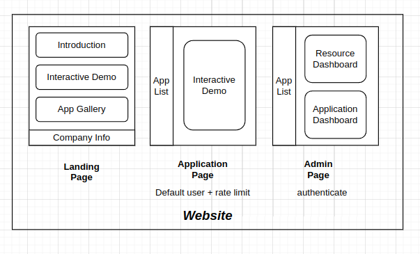

Today, building a simple interactive demo for machine learning is easier than ever. But developing a full web application to host and share your model can be a daunting task. In this article, we will explore the fundamentals of React, a popular JavaScript library for building user interfaces, and discuss some use cases for full-stack web app development.

## What is React?

## Fundamentals of React

## Use Cases for React

## Integrate ML demo with React

## Build a Simple Web App with React & FastAPI
A simple web app that consists of a landing page, application page, and admin page.
- Landing page: a simple page that introduces the application and provides a link to the application page.
- Application page: a page that allows users to upload an image and get a prediction from the model.
- Admin page: a page that allows administrators to view and manage the application.

### Frontend Development with React

### Backend Development with FastAPI

## References
- [React Documentation](https://react.dev/learn)
- [Free React / Next.js landing page template](https://github.com/cruip/open-react-template?tab=readme-ov-file)
- [Embedding gradio with Web Components](https://www.gradio.app/guides/sharing-your-app#embedding-with-web-components)
- [Free ML-powered Web Apps (React, Javascript) Tutorial with Gradio API [Hugging Face]](https://www.youtube.com/watch?v=3IPttgpUWHg)